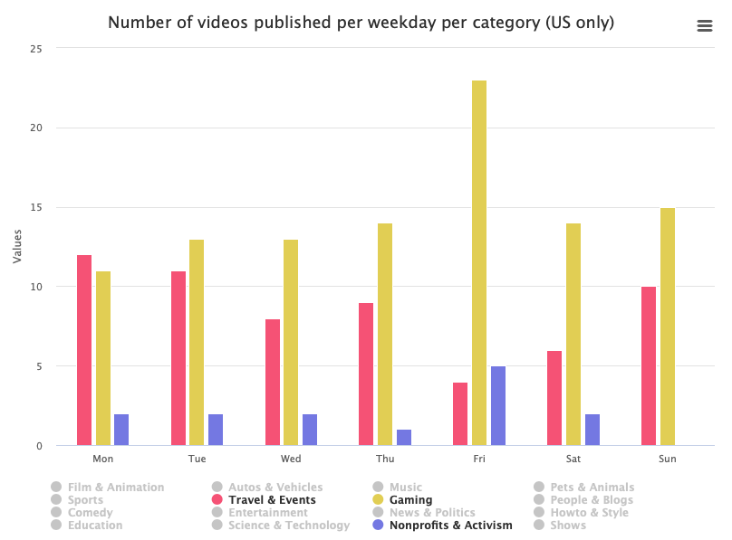
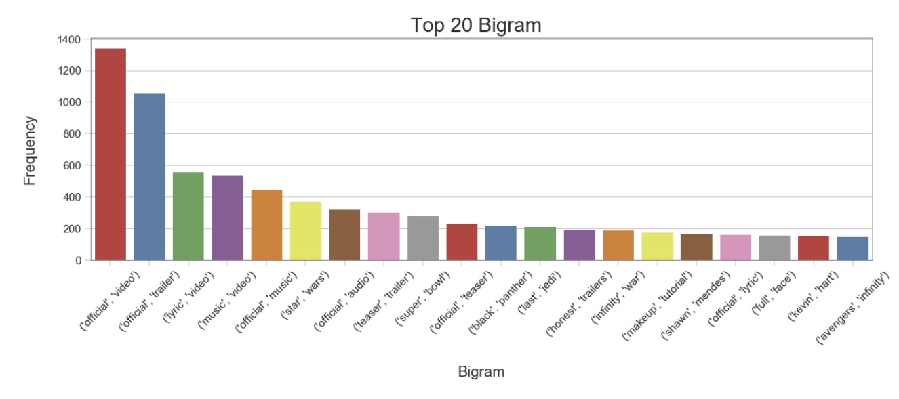
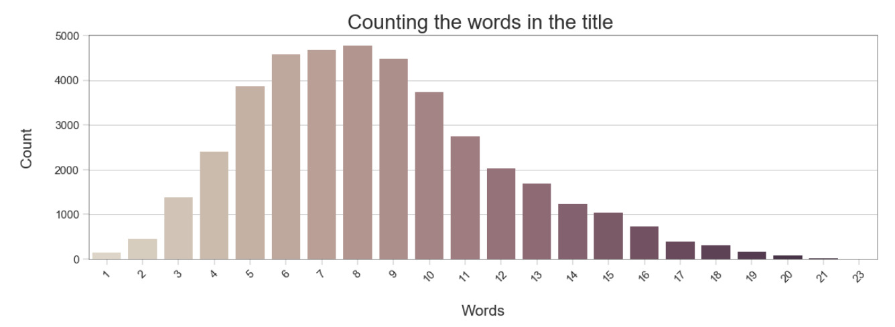

# Dataset
The dataset selected for this project is a daily record of the top trending YouTube videos. It proposes numerous insights such as title, channel name, category, views, likes, dislikes, comments, publish time, tags, etc. from different regions of the planet (USA, Great Britain, Germany, Canada, France, Russia, Mexico, South Korea, Japan and India).

It is provided by kaggle (https://www.kaggle.com/datasnaek/youtube-new/) and offers information for more than 200k top trending videos.

# Problematic
Ever wanted to create a successful YouTube channel?

Our web app will provide you essential information on how to optimize the publishing of your videos.

By selecting any information such as the category, the country or even the name of your channel you will be able to compare yourself to the top trending videos.

Let’s put a context: you live in the USA and you want to create a YouTube sport channel.

We will inform you about:
- The current number of sport channel in USA
- Example of Sport youtube channel
- like/dislike ratio
- View/ like/Comment correlation
- The trend day to upload your video
- The trend length of title
- The trend Bigram of title
- The Evolution of the category through the years

And many more indicators that will allow you to chose the best title, and publishing time.

This website will be fully interactive and ensure an easy way to get some statistics and make some comparisons according to what one wants.

# Exploratory Data Analysis

We aim to analyze and expose four dimensions of our dataset: title, publish date, category, and geographical region.

### Publish date analysis

Concerning the publish date and time analysis, we did a yearly, monthly, weekday and hourly analysis to understand when videos are published the most. Our data contains different countries which means we need to be aware of different time zones and inversion of seasons. Some basic statistics we found are:

- An increasing number of views in trending videos throughout the years
- Most months have the same popularity, but some are very low
- Without taking into account the categories, videos tend to be published by the end of the day in general

To go deeper in the time analysis it will also be interesting to find the evolution of the number of views of each category throughout the years.

In the total appearances in trending analysis, there is a great difference between videos and channels. Using videos solely, the videos with most appearances tend to be movie trailers. When looking at channels, here we have the most popular channels with a big variety of content. Finally, the biggest mean number of appearances per video of each channel shows a lot of music videos.

### Category analysis

Grouping the dataset by category, we computed numerous statistics such as the distribution of the number of videos published, likes, dislikes, views, and comments. Aggregating such statistics by publication weekday (also done by hour and month) we found interesting insights showing that some categories have a high amount of published videos on specific weekdays. The figure below shows the number of top trending videos published per weekday for three categories: Travel & Events (pink), Gaming (yellow) and Nonprofit & Activism (violet). We can see that Friday is an important day for Gaming and Nonprofit & Activism categories, whereas it’s the least important day for the Events & Travel category.

### Title analysis

The title analysis gives the average number of words in the title as well as the top Bigram of a given category in a given country.

Top 20 Bigrams used in the title:

Number of words in the title:

Mostly used words in the title:

# Related work

Other approaches with the same dataset includes:

- What is the most frequent type of video?
- Is the distribution of views, likes, comments and engamet equal for all categories?
- Do we have normal distribution to the values?
- What are the most frequent names in title, description, tags?

Our approach is original from the other common analysis due to the way it is meant to be used. As stated in our problematic it should help new content creators optimize their videos publishings through the clear visualization of all useful statistics related to other trending videos from the given data.

This dataset is completely new for all of the team members.
