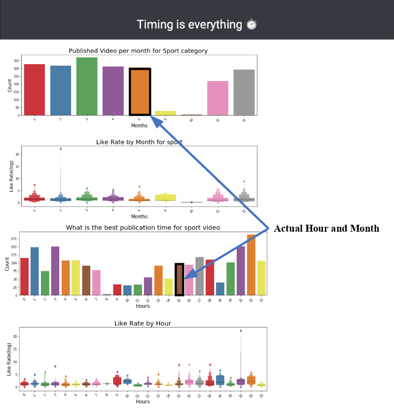

# Milestone 2

Our project goal is to take a YouTube content creator through a series of visualisations of data analysis from trending YouTube videos so that he can make his own trending video. The goal is broken down in different analysis such as the user’s country, video tags, title and publishing time.

## Sketches of the visualization

## Tools needed for each visualization

The following lectures are the main ones going to help us achieve our goals: D3.js, Interactions, More interactive d3.js, Maps, Graphs, Designing viz, Do and dont in viz, Perception colors, Text viz.

## Goals and planning

We have 4 sections to work on:
1. General overview of the trending video per country
2. Title optimization: number of words per category
3. Tags choice
4. Timing: show the best timing to publish the video in the selected category

Some enhancement ideas for our sketches are presented in the sketches next to each visualization.

## Functional project prototype

The code of the functional project prototype is in the `/first_mookup` folder at the root of this repository. Clone the repo and open the `index.html` file to visualize in a browser the mookup.
